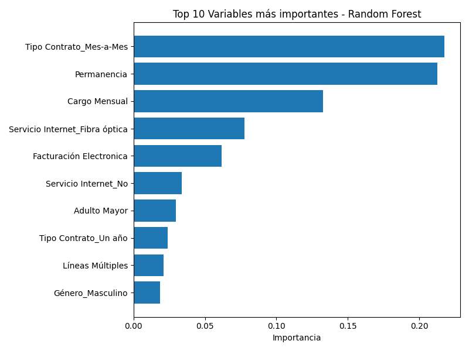

# 📄 Informe de análisis predictivo de cancelación de clientes

## 🧩 Objetivo del proyecto

El propósito de este análisis fue construir un modelo predictivo capaz de identificar clientes con alta probabilidad de cancelar su contrato (evasión), permitiendo a la empresa anticiparse y aplicar estrategias de retención personalizadas.

---

## 🧪 Metodología

### 1. **Exploración y Preparación de los Datos**

- Dataset con 7.267 clientes y 21 variables.
- Se eliminaron variables redundantes: `Cargo Diario` y `Cargo Total`, por derivarse directamente de otras columnas.
- La clase objetivo `Evasión` está desbalanceada (~25.7% clientes evasores), por lo que se aplicó **SMOTE** para balancear el conjunto de entrenamiento.

### 2. **Modelos Evaluados**

Se entrenaron y compararon los siguientes modelos:

| Modelo                          | Accuracy | Recall (Clase 1) | F1-Score (Clase 1) | AUC      |
| ------------------------------- | -------- | ---------------- | ------------------ | -------- |
| Regresión Logística             | 80%      | 53.2%            | 57.8%              | 0.84     |
| Árbol de Decisión               | 72%      | 46.5%            | 46.1%              | 0.65     |
| Random Forest (SMOTE)           | 76.9%    | 56.4%            | 55.7%              | 0.81     |
| XGBoost (SMOTE)                 | 75.4%    | 54.8%            | 53.4%              | 0.80     |
| ✅ Random Forest **Optimizado** | ✅ 77.6% | ✅ 67.1%         | ✅ 60.7%           | ✅ 0.825 |

El modelo final seleccionado fue **Random Forest optimizado**, debido a su mejor balance entre precisión y recall, y su mayor capacidad de discriminación (AUC = 0.825).

---

## 🔍 Principales factores que influyen en la cancelación

Se evaluó la **importancia de las variables** del modelo Random Forest optimizado. A continuación, se muestran las variables más influyentes:

Estas variables indican que la **naturaleza del contrato y los servicios adicionales contratados** son factores determinantes en la decisión de cancelar.

---

## 💡 Estrategias de retención basadas en resultados

### 1. 🔁 Migración a contratos a largo plazo

- Los contratos mensuales presentan una alta tasa de evasión.
- **Propuesta**: Ofrecer descuentos o beneficios adicionales a quienes migren a contratos anuales.

### 2. 💸 Revisión del cargo mensual

- Clientes con **cargos altos tienden a cancelar más**.
- **Propuesta**: Aplicar pricing diferenciado según nivel de uso o comportamiento (tarifas personalizadas).

### 3. 📱 Servicios digitales mal utilizados o poco valorados

- Servicios como **Protección de Dispositivo, Respaldo en Línea y Soporte Técnico** tienen alta correlación con la cancelación.
- **Propuesta**: Evaluar su percepción de valor y mejorar su comunicación o eliminar cargos por servicios no utilizados.

### 4. 📶 Optimización del servicio de Internet

- Quienes no contratan servicio de internet o tienen problemas con él tienden a cancelar más.
- **Propuesta**: Reforzar infraestructura, soporte técnico y campañas de migración a mejores planes.

### 5. 💳 Incentivos por método de pago

- Clientes con métodos como **pago electrónico automático (débito/crédito)** muestran menor propensión al churn.
- **Propuesta**: Ofrecer beneficios exclusivos a quienes adopten medios de pago electrónicos.

---

## 📈 Recomendaciones técnicas

- Monitorear mensualmente el desempeño del modelo y reentrenarlo con datos recientes.
- Ajustar el umbral de clasificación para maximizar ganancias según la matriz de costos del negocio.
- Construir una API o sistema interno para consultar el score de churn de cada cliente en tiempo real.
- Complementar el modelo con información más contextual, como interacciones con soporte o encuestas de satisfacción.

---

## 📌 Conclusión

Gracias al modelo de **Random Forest optimizado**, es posible detectar con buena precisión a los clientes con alto riesgo de cancelación, permitiendo intervenir de manera preventiva con estrategias más efectivas.

La empresa cuenta ahora con una herramienta analítica que, usada de forma estratégica, puede **reducir significativamente la tasa de evasión y aumentar la fidelización de clientes.**

---
